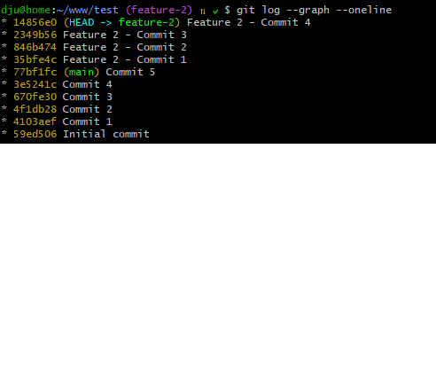
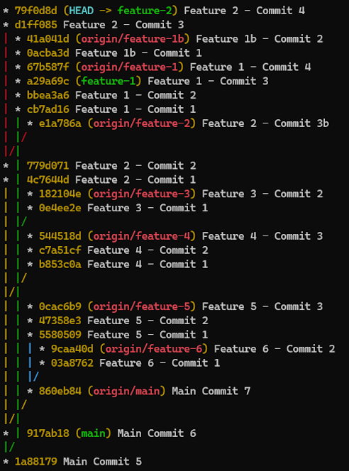
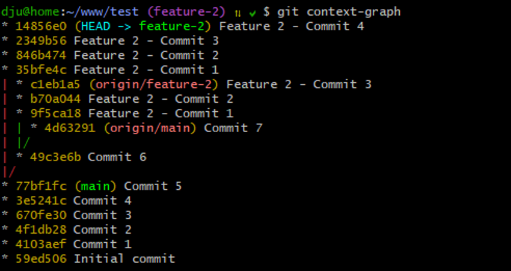

# git-context-graph

[](https://github.com/Djuuu/git-context-graph/actions/workflows/tests.yml)
[](https://web.archive.org/web/20160322002352/http://www.cs.trincoll.edu/hfoss/wiki/Chris_Fei:_Beerware_License)

Show graph log of branch, default repository branch, and their remote counterparts.

This is a shortcut to `git log --graph` which provides a middle ground between
showing _only a given branch_ (which might lack context) and showing _all_ branches 
(which might get crowded on big projects).

|           `git log --graph --oneline`            |          `git log --graph --oneline --all`          |
|:------------------------------------------------:|:---------------------------------------------------:|
|  |  |

|                **`git context-graph`**                |
|:-----------------------------------------------------:|
|  |

## Description

This command is a shortcut to:
> ```bash
> git log --color --graph --abbrev-commit --decorate --pretty=oneline \
>     my-branch origin/my-branch \
>     main      origin/main
> ```

By default, a branch is shown along with the default repository branch (`main` / `master`),
their remote counterparts, plus any [additional context branches](#branch-context-configuration) you have configured.

## Usage

Show the graph for the current branch:
```bash
git context-graph
```

Show the graph for one or more specific branches:
```bash
git context-graph my-branch other-branch
```

By default, branch arguments replace the current branch as the graph's subject.
Use `--add` (`-a`) to add them to the current branch instead:
```bash
git context-graph --add other-branch   # (-a) graph the current branch together with other-branch
```

Narrow down what is shown:
```bash
git context-graph --local        # only local branches (ignore remotes)
git context-graph --no-default   # omit the default branch (main / master)
```

Any `git-log` option can be passed through to refine or customize the output
(see the [git-log documentation](https://git-scm.com/docs/git-log)):
```bash
git context-graph --pretty=medium -- some/path
```

### Listing branches

Instead of drawing the graph, list the branches involved:
```bash
git context-graph --list           # branches that would be shown in the graph
git context-graph --list --short   # ... using short names
```

## Branch context configuration

On top of the branches shown by default, you can persist **additional context branches** per branch.
These are stored in the repository's local git config (under `branch.<name>.context`) and are automatically included
whenever you graph that branch.

**Add** branches to a context - `--config-add` (`-A`):
```bash
# git context-graph [<base_branch>...] -A|--config-add <additional_branch>...
git context-graph --config-add feature-a2            # add branch(es) to current branch context
git context-graph feature-a1 --config-add feature-a2 # ... or to a specific branch context
```

**Clear** context branches - `--config-clear` (`-C`):
```bash
# git context-graph [<base_branch>...] -C|--config-clear [<additional_branch>...]
git context-graph --config-clear                       # clear all configured context branches for current branch
git context-graph --config-clear feature-a2            # ... or remove a specific branch from current branch context
git context-graph feature-a1 --config-clear            # ... or clear all context branches for a specific branch
git context-graph feature-a1 --config-clear feature-a2 # ... or remove a specific branch from a specific branch context
```

**Toggle** a branch in/out of a context - `--config-toggle` (`-T`):
```bash
# git context-graph [<base_branch>...] -T|--config-toggle <additional_branch>...
git context-graph --config-toggle feature-a3   # toggle a branch in/out of current branch context
```

**Sync** a branch's context into a shared preset - `--sync` (`-S`):
```bash
# git context-graph [<base_branch>] [<config edit>] -S|--sync
git context-graph --sync                         # make every branch in the set reference the others
git context-graph --config-add feature-a3 --sync # ... or apply an edit, then propagate it to the whole preset
```
Used on its own, `--sync` mirrors a branch's context across the set so every member references all the others.
Combined with `--config-add`/`--config-clear`/`--config-toggle`, the edit is applied and then synced:
a branch removed from the preset is detached from every member (keeping only its unrelated context),
and clearing a branch's whole context tears the preset down.

**Reset** the whole repository's context configuration - `--config-reset` (`-Z`):
```bash
# git context-graph -Z|--config-reset
git context-graph --config-reset   # remove all branch context configuration (asks for confirmation)
```

To review context membership across the repository, list all local branches flagged by whether they belong to a branch's context:
```bash
# git context-graph [<base_branch>] -v|--list-status
git context-graph --list-status    # all local branches, flagged by context membership
```
Markers:
- `' * '` current / reference,
- `'[*]'` in context,
- `'[ ]'` not in context.

Example output:
> ```
>  * 	feature-a1
> [*]	feature-a2
> [*]	feature-a3
> [ ]	feature-b1
> [ ]	feature-b2
> ```

## Arguments

* `<base_branch>...`  
  Branch(es) to show graph for. If omitted, current branch will be used.

## Options

### Graphing

* `-a`|`--add` `<additional_branch>...`  
  Consider `<additional_branch>` argument(s) as additional branch(es) (_added_ to current branch).

* `--local`  
  Show only local branches (ignore remotes).

* `--no-default`  
  Show only related branches (local and remote), without default branch.

### Listing

* `-l`|`--list`  
  List branches that would be shown in the graph (does not display graph).

* `-s`|`--short`  
  Use short branch names when listing branches (without `refs/heads/` or `refs/remotes/`).  
  Implies `--list`.

* `-v`|`--list-status`  
  List local branches, flagging those in the current branch's context.  
  `' * '` current / reference, `'[*]'` in context, `'[ ]'` not in context.

### Branch context configuration

* `-A`|`--config-add` `<additional_branch>...`  
  For a given branch, persist additional context branches to git configuration.

* `-C`|`--config-clear` `[<additional_branch>...]`  
  For a given branch, remove additional context branches from git configuration.  
  If no additional branch is passed, all configured additional branches will be removed.

* `-T`|`--config-toggle` `<additional_branch>...`  
  For a given branch, toggle specified branches from context in git configuration.

* `-S`|`--sync`  
  Synchronize a branch's context into a shared preset where every branch in the set references all the others.  
  Works on its own or propagates an edit to the whole preset (`--config-add`/`--config-clear`/`--config-toggle`).  
  A branch removed from the preset is detached from all its members, keeping only unrelated context.

* `-Z`|`--config-reset`  
  Remove all branch context configuration from the repository, after confirmation.

### Help

* `-h`|`--usage`  
  Show command usage.

## Installation

* Add the `git-context-graph` directory to your `PATH`<br>
  in one of your shell startup scripts:
  ```bash
  PATH="${PATH}:/path/to/git-context-graph"
  ```

_OR_ 

* Define it as a git alias:<br>
  run:
  ```bash
  git config --global alias.cg '!bash /path/to/git-context-graph/git-context-graph'
  ```
  or edit your `~/.gitconfig` directly:
  ```
  [alias]
  	cg = "!bash /path/to/git-context-graph/git-context-graph"
  ```

Completion is available in `git-context-graph-completion.bash`. Source it in one of your shell startup scripts:
```bash
. "/path/to/git-context-graph/git-context-graph-completion.bash"
```
