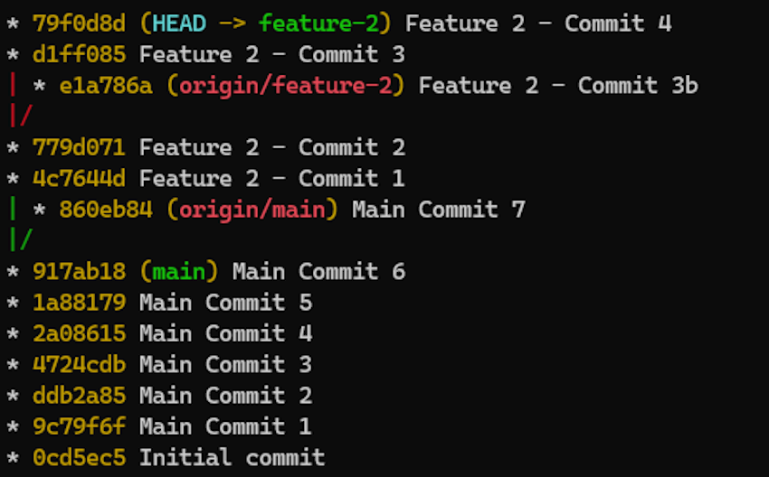

# git-context-graph

Show graph log of branch with its remote counterparts and default repository branch.

This is a shortcut to `git log --graph` which provides a middle ground between
showing _only a given branch_ (which might lack context) and showing _all_ branches 
(which might get crowded on big projects).

|                `git log --graph`                 |               `git log --graph --all`               |
|:------------------------------------------------:|:---------------------------------------------------:|
|  |  |

|                **`git context-graph`**                |
|:-----------------------------------------------------:|
|  |

## Synopsis

<code><b>git context-graph</b> <i>[--no-default] [-a|--add] [&lt;branch&gt;...]</i></code>  
<code><b>git context-graph</b> <i>[&lt;git-log options&gt;...] [&lt;options&gt;...] [&lt;branch&gt;...] [-- &lt;paths&gt;...]</i></code>  

<code><b>git context-graph</b> <i>(-l|--list) [-s|--short] [&lt;branch&gt;]</i></code>  

<code><b>git context-graph</b> <i>[&lt;branch&gt;...] (-A|--config-add) &lt;additional_branch&gt;...</i></code>  
<code><b>git context-graph</b> <i>[&lt;branch&gt;...] (-C|--config-clear) [&lt;additional_branch&gt;...]</i></code>

<code><b>git context-graph</b> <i>(-h|--usage)</i></code>

## Description

This command is a shortcut to:
```bash
git log --color --graph --abbrev-commit --decorate --pretty=oneline \
    my-branch origin/my-branch main origin/main ...
```

* <code><b>git context-graph</b> <i>[--no-default] [-a|--add] [&lt;branch&gt;...]</i></code>  
  Show graph log of branch, its remote counterparts and default branch.

* <code><b>git context-graph</b> <i>[&lt;git-log options&gt;...] [&lt;options&gt;...] [&lt;branch&gt;...] [-- &lt;paths&gt;...]</i></code>  
  `git-log` options can be used to refine or customize the output  
  (see git-log documentation: https://git-scm.com/docs/git-log)  
  Ex:  
  <code>git context-graph --pretty=medium -- some/path</code>

* <code><b>git context-graph</b> <i>(-l|--list) [-s|--short] [&lt;branch&gt;...]</i></code>  
  List branches that would be shown in the graph (does not display graph).

* <code><b>git context-graph</b> <i>[&lt;branch&gt;...] (-A|--config-add) &lt;additional_branch&gt;...</i></code>  
  <code><b>git context-graph</b> <i>[&lt;branch&gt;...] (-C|--config-clear) [&lt;additional_branch&gt;...]</i></code>  
  For a given branch, persist additional context branches to git configuration.

* <code><b>git context-graph</b> <i>(-h|--usage)</i></code>  
  Show the help page.

## Arguments

* `<branch>...`  
  Branches to show graph for. If omitted, current branch will be used.

## Options

* `-a`|`--add`  
  Consider `<branch>` arguments as additional branches (added to current branch).

* `--no-default`  
  Show only related branches (local and remote), without default branch.

* `-l`|`--list`  
  List branches that would be shown in the graph (does not display graph).

* `-s`|`--short`  
  Use short branch names when listing branches (without `refs/heads/` or `refs/remotes/`).  
  Implies `--list`.

* `-A`|`--config-add` `<additional_branch>...`  
  For a given branch, persist additional context branches to git configuration.

* `-C`|`--config-clear` `[<additional_branch>...]`  
  For a given branch, remove additional context branches from git configuration.  
  If no additional branch is passed, all configured additional branches will be removed.

* `-h`|`--usage`  
  Show command usage.

## Installation

* Add the `git-context-graph` directory to your `PATH`<br>
  in one of your shell startup scripts:
  ```bash
  PATH="${PATH}:/path/to/git-context-graph"
  ```

_OR_ 

* Define it as a git alias:<br>
  run:
  ```bash
  git config --global alias.cg '!bash /path/to/git-context-graph/git-context-graph'
  ```
  or edit your `~/.gitconfig` directly:
  ```
  [alias]
  	cg = "!bash /path/to/git-context-graph/git-context-graph"
  ```

Completion is available in `.git-completion.bash`. Source it in one of your shell startup scripts:
```bash
. "/path/to/git-context-graph/.git-completion.bash"
```
